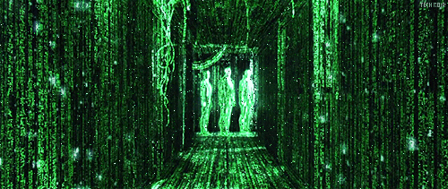
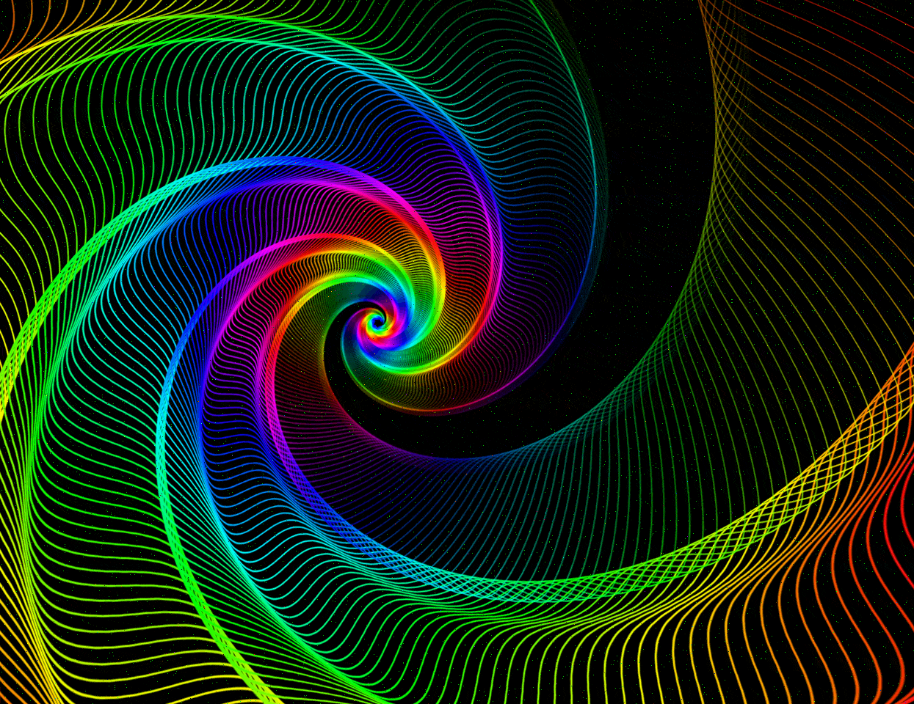
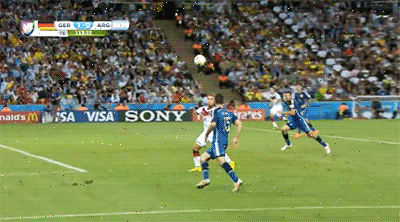

# GIFNoise

A small personal effort to understand the GIF format in greater detail. Attempt to hide content in GIFs (mainly GIF89a), mostly inspired by [DTM's article](https://dtm.uk/gif-steganography/). Extended upon the main concepts by distributing the LSB-encoded pixels across each frame instead to prevent noise from clustering near any particular location of the GIF.

## Usage

Hide content within a GIF using key "secretkey" (generates a GIF named `hidden.gif`):

```sh
python3 gifnoise.py hide secretkey matrix.gif cat.jpg 
```

The key is used in generating derived keys which specifies the order of pixel selection in each frame. Selected pixels are used to hide the data via LSB encoding. It would require more effort to retrieve the original hidden content without the key (perhaps not impossible since analysis of pixel values across frames might reveal anomalies that indicate LSB encoding of a pixel in a specific frame...)

Recover content from from GIF (showcat.jpg should be the same as cat.jpg):

```sh
python3 gifnoise.py show secretkey hidden.gif showcat.jpg
```

It is recommended to:
* not overload any GIF and store too much data as LSB as the resulting image would have pretty high "noise".
* Pick GIFs with multiple moving components to make the presence of "noise" less obvious.

## Examples

Consider hiding a file `cat.jpg` in `matrix.gif` with the key "secretkey" as per the usage instructions:

`cat.jpg` - 6KB [Source](https://www.instagram.com/p/CpvY6PBPQ79/) [MD5=a1aa8c33d1fc5a9e40fad0d2db86e737]:


`matrix.gif` - 862KB [Source](https://giphy.com/gifs/technoir-movie-film-cinemagraph-zXmbOaTpbY6mA):

 

The result is as follows (notice additional "noise" across frames):



Another example is hiding `cat.jpg` in `spiral.gif`:

`spiral.gif` - 1.4MB [Source](https://pixabay.com/gifs/raindow-moving-spiral-colorful-3351/):


The result is as follows (notice "noise" in black background):

`hidden_spiral.gif`:



Here are a few other examples with `cat.jpg` inside for your reference also with "secretkey" as the key:

`dancing_pallbearers.gif` (1.4MB, [Source](https://giphy.com/gifs/ghana-dancing-pallbearers-coffin-Wr2747CnxwBSqyK6xt)):


`world_cup.gif` (2.1MB, [Source](https://www.pinterest.com/pin/pin-for-later-the-13-craziest-world-cup-moments-in-gifs-the-goal-that-won-the-world-cup-by-none-other-than-the-germ--164944405082541071/)):




